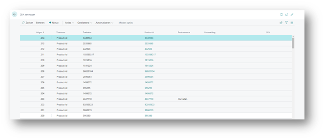

# Handleiding 2BA Integration
Deze handleiding beschrijft hoe je de 2BA Integration app kunt gebruiken om te zoeken in de 2BA database vanuit Business Central en een gevonden 2BA product/trade item kunt omzetten naar een artikel in Business Central.

## Automatische update
De 2BA app kent ook een automatische update. Deze voert in de achtergrond de update uit. Als er bij de update fouten optreden is dit terug te zien in de 2BA aanvragen lijst:

 
Als de bron van de fout is weggenomen zal het artikel de volgende ronde worden bijgewerkt. Op de artikelkaart kan men ook handmatig kiezen voor [Bijwerken vanuit 2BA}. Dan wordt het bijwerken direct uitgevoerd en zal er direct ook een foutmelding komen als er toch nog iets niet goed staat.

[:arrow_left:](../README.md) [Back](../README.md)