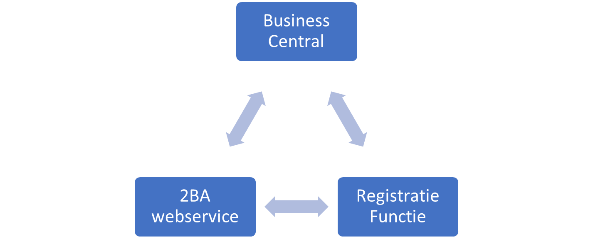
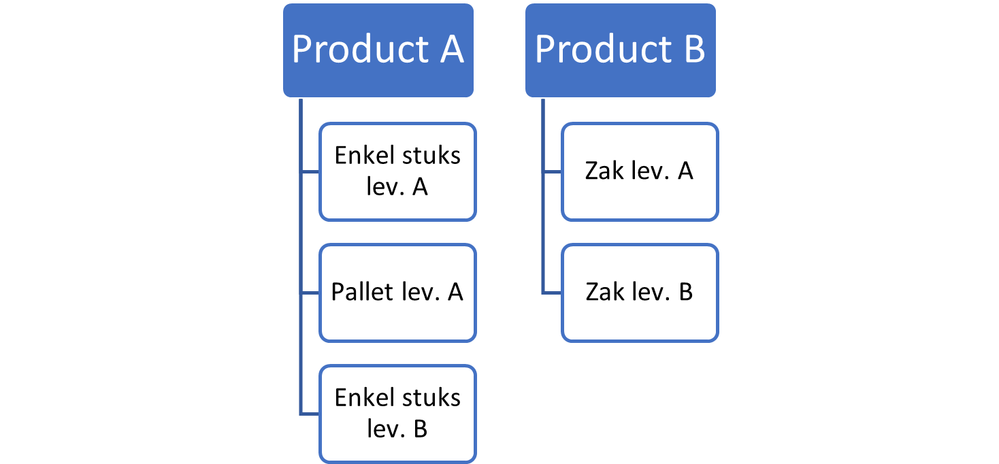

# Handleiding 2BA Integration
Deze handleiding beschrijft hoe je de 2BA Integration app kunt gebruiken om te zoeken in de 2BA database vanuit Business Central en een gevonden 2BA product/trade item kunt omzetten naar een artikel in Business Central.

## Algemene beschrijving
De 2BA app maakt gebruik van de webservices van 2BA om te zoeken in de 2BA database. Om de toegang te regelen voor alle gebruikers, wordt er gebruik gemaakt van een door Bluace beschikbaar gestelde Registratieservice.

In de 2BA database kun je producten vinden. Voor ieder product zijn er zogenaamde handelsartikelen. De handelsartikelen zijn een vastlegging per verpakking en per leverancier wat besteld kan worden tegen welke prijs.

[:arrow_left:](../README.md) [Back](../README.md)