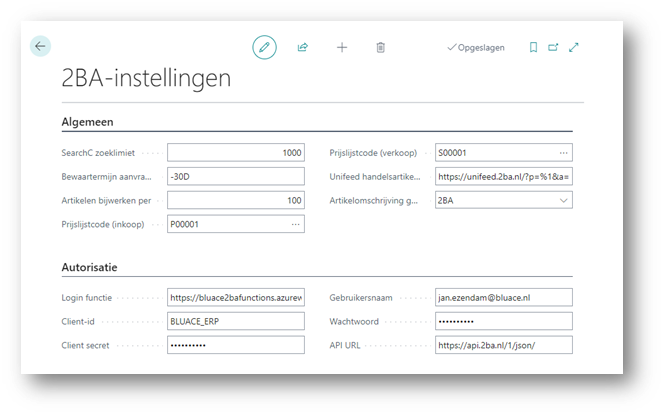
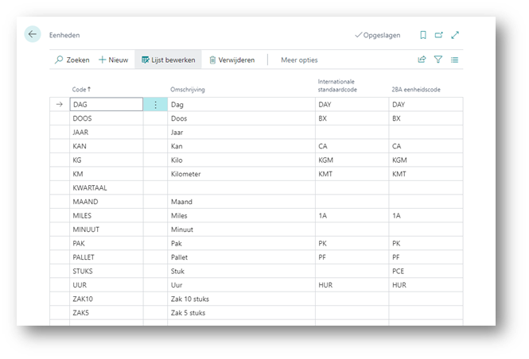
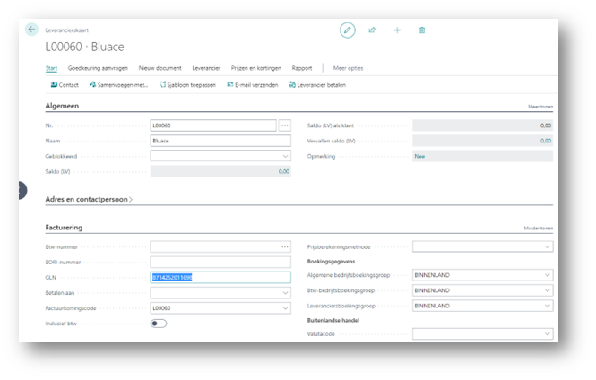
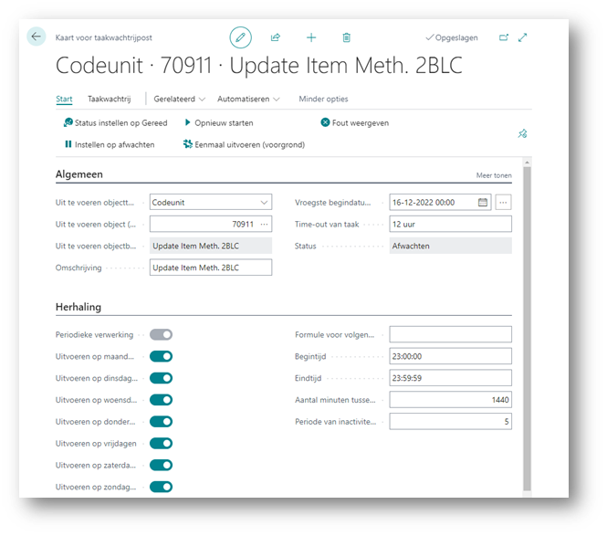

# Handleiding 2BA Integration
Deze handleiding beschrijft hoe je de 2BA Integration app kunt gebruiken om te zoeken in de 2BA database vanuit Business Central en een gevonden 2BA product/trade item kunt omzetten naar een artikel in Business Central.

## Installatie en registratie

### Instellingen
Alvorens de 2BA app gebruikt kan worden moeten er een aantal instellingen gedaan worden. Daarvoor ga je naar de 2BA instellingen:

* **SearchC zoeklimiet:** Het aantal producten dat maximaal opgehaald wordt bij een zoekactie
* **Bewaartermijn aanvraag:** Tot hoeveel tijd terug moeten zoekaanvragen bewaard blijven (-30D betekent tot 30 dagen terug)
* **Artikelen bijwerken per:** Het aantal artikelen dat door de automatische bijwerk taak per keer wordt bijgewerkt te beginnen bij de oudste.
* **Prijslijstcode (Inkoop):** De Code van de default Inkoopprijslijst die de 2BA app mag gebrijken voor het opslaan van de artikelinkoop prijzen.
* **Prijslijstcode (Verkoop):** De Code van de default Verkoopprijslijst die de 2BA app mag gebrijken voor het opslaan van de artikelverkoop prijzen.
* **Unifeed handelsartikel URL:** Deze instelling wordt gebruikt voor het link naar het handelsartikel op de 2BA website. Hier moet staan: https://unifeed.2ba.nl/?p=%1&a=%2
* **Artikelomschrijving gebruiken:** Geeft aan welke omschrijving leidend is: de bestaande omschrijving uit het artikel of de omschrijving uit 2BA.
* **Login functie:** Link naar de registratieservice (verkrijgbaar bij Bluace)
* **Client-ID:** De door de 2BA organisatie beschikbaar gestelde Client-ID
* **Client secret:** Het door de 2BA organisatie beschikbaar gestelde Client secret
* **Gebruikersnaam:** De gebruikersnaam waaronder de 2BA web service gebruikt gaat worden. De gebruiker die opgegeven wordt moet in 2BA rechten hebben voor <Data(download)> en <Webservices contact>.
* **Wachtwoord:** Het bijbehorende wachtwoord
* **API URL:** Link naar de 2BA webservice. Hier moet staan: https://api.2ba.nl/1/json/

### Eenheden vertaling
De in 2BA gebruikte eenheden worden vertaald in de 2BA app aan de hand van de Eenheden tabel:

### Leveranciers
De 2BA app gaat alleen zoeken in 2BA voor leveranciers die een GLN nummer hebben:

### Artikelsjablonen
De 2BA app maakt voor het aanmaken van nieuwe artikelen gebruik van artikel sjablonen. Hiervan moet er minimaal 1 ingericht zijn voor de velden waarvoor de 2BA app geen gegevens heeft zoals bijvoorbeeld boekingsgroepen, aanvullingsmethode en bestelbeleid.

### Automatische update
Om de automatische update te activeren moet er een periodieke taakwachtrijpost worden aangemaakt:

Zet hier Codeunit 70911 in en stel de taakwachtrijpost in naar wens.

[:arrow_left:](../README.md) [Back](../README.md)