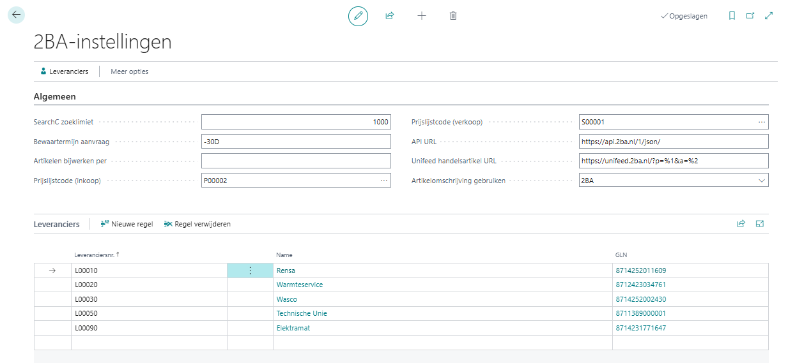
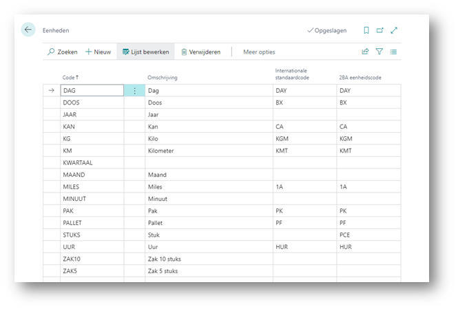
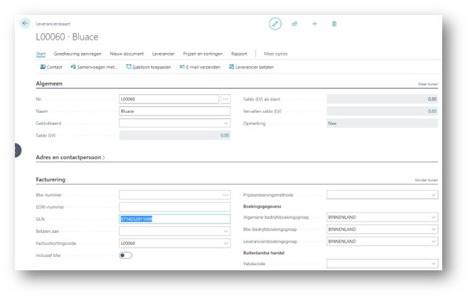
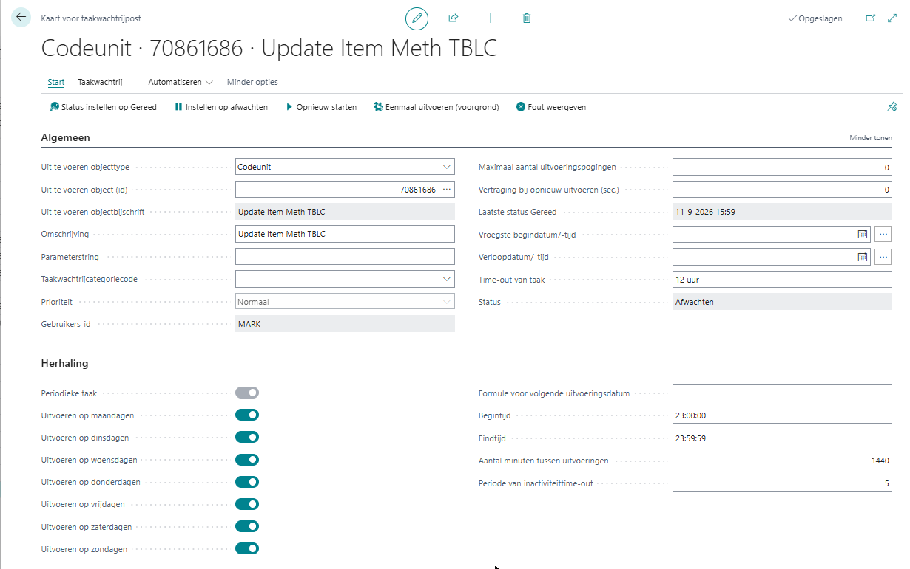

# Handleiding 2BA Integration
Deze handleiding beschrijft hoe je de 2BA Integration app kunt gebruiken om te zoeken in de 2BA database vanuit Business Central en een gevonden 2BA product/trade item kunt omzetten naar een artikel in Business Central.

## Installatie en registratie

### Instellingen
Alvorens de 2BA app gebruikt kan worden moeten er een aantal instellingen gedaan worden. Daarvoor ga je naar de 2BA instellingen:

* **SearchC zoeklimiet:** Het aantal producten dat maximaal opgehaald wordt bij een zoekactie (maximaal 1000, standaard 1000)
* **Bewaartermijn aanvraag:** Tot hoeveel tijd terug moeten zoekaanvragen bewaard blijven (-30D betekent tot 30 dagen terug) (standaard ingesteld op -30D)
* **Artikelen bijwerken per:** Het aantal artikelen dat door de automatische bijwerk taak per keer wordt bijgewerkt te beginnen bij de oudste.
* **Prijslijstcode (Inkoop):** De Code van de default Inkoopprijslijst die de 2BA app mag gebrijken voor het opslaan van de artikelinkoop prijzen.
* **Prijslijstcode (Verkoop):** De Code van de default Verkoopprijslijst die de 2BA app mag gebrijken voor het opslaan van de artikelverkoop prijzen.
* **Unifeed handelsartikel URL:** Deze instelling wordt gebruikt voor het link naar het handelsartikel op de 2BA website. Hier moet staan: https://unifeed.2ba.nl/?p=%1&a=%2
* **Artikelomschrijving gebruiken:** Geeft aan welke omschrijving leidend is: de bestaande omschrijving uit het artikel of de omschrijving uit 2BA.
* **API URL:** Link naar de 2BA webservice. Hier moet staan: https://api.2ba.nl/1/json/

### Product activeren (autorisatie)
De autorisatiegegevens voor de 2BA webservice voer je in via de standaard Business Central activerings- en instellingenfunctie:

* Bij het eerste gebruik verschijnt in de **Assisted Setup** (Aan de slag) de taak **Product activeren**. Deze wordt automatisch aangeboden zolang de 2BA-licentie nog niet actief/geldig is.
* Daarna is dezelfde wizard op elk moment opnieuw te openen via **Handmatige installatie** (Manual Setup), categorie **2BA Integration**.

Beide starten de pagina **2BA authenticatie-instellingen** met de volgende velden:

* **Client-id:** De door de 2BA organisatie beschikbaar gestelde Client-ID.
* **Client secret:** Het door de 2BA organisatie beschikbaar gestelde Client secret.
* **Gebruikersnaam:** De gebruikersnaam waaronder de 2BA webservice gebruikt gaat worden. De gebruiker die opgegeven wordt moet in 2BA rechten hebben voor \<Data(download)\> en \<Webservices contact\>.
* **Wachtwoord:** Het bijbehorende wachtwoord.
* **Authenticatie URL:** Link naar de registratie-/autorisatieservice van Bluace. Wordt standaard voorgesteld als https://authorize.2ba.nl/OAuth/Authorize.

Pas nadat deze gegevens zijn ingevuld en opgeslagen is de licentie geldig en kan de 2BA app gebruikt worden; zonder geldige licentie geeft de app de foutmelding "license is not valid or not activated".

### Eenheden vertaling
De in 2BA gebruikte eenheden worden vertaald in de 2BA app aan de hand van de Eenheden tabel:

### Leveranciers

De 2BA app gaat alleen zoeken in 2BA voor leveranciers die zijn opgenomen in de lijst **2BA leveranciers** én die een GLN nummer hebben. Het enkel invullen van een GLN op de leverancierskaart is niet meer voldoende: de leverancier moet ook expliciet aan de lijst worden toegevoegd. Dit kan op twee manieren:

* via de subpagina **Leveranciers** onderaan de pagina 2BA-instellingen, of
* via de actie **Leveranciers** op de pagina 2BA-instellingen, die de volledige lijst **2BA leveranciers** opent.

In beide gevallen geef je het leveranciersnummer op; naam en GLN worden automatisch getoond op basis van de leverancierskaart. Het GLN nummer zelf vul je nog steeds in op de leverancierskaart zelf:

### Artikelsjablonen
De 2BA app maakt voor het aanmaken van nieuwe artikelen gebruik van artikel sjablonen. Hiervan moet er minimaal 1 ingericht zijn voor de velden waarvoor de 2BA app geen gegevens heeft zoals bijvoorbeeld boekingsgroepen, aanvullingsmethode en bestelbeleid.

### Automatische update
Om de automatische update te activeren moet er een periodieke taakwachtrijpost worden aangemaakt:

Zet hier Codeunit **70861686 ("Update Item Meth TBLC")** in en stel de taakwachtrijpost in naar wens.

[:arrow_left:](../README.md) [Back](../README.md)