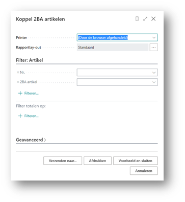
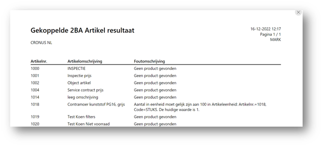

# Handleiding 2BA Integration
Deze handleiding beschrijft hoe je de 2BA Integration app kunt gebruiken om te zoeken in de 2BA database vanuit Business Central en een gevonden 2BA product/trade item kunt omzetten naar een artikel in Business Central.

## Koppel 2BA artikel
Deze kan men gebruiken om te proberen bestaande artikelen te koppelen aan een 2BA product. Je kunt deze opstarten vanuit het menu of via een taakwachtrijpost:
 

Geef eventueel filters op als je maar een deel van de artikelen langs wilt lopen. Als het rapport klaar is krijg je een lijst met artikelen die niet gekoppeld konden worden met de reden waarom:
 

De betekenis van de melding is als volgt:
* **Geen product gevonden:** Op basis van de kruisverwijzingen is er geen enkel product gevonden in 2BA.
* **Geen passende handelsartikelen gevonden:** Er is wel een product gevonden, maar geen van de bijbehorende handelsartikelen kwam overeen met een of meerdere artikelreferenties.
* **Aantal in eenheid moet gelijk zijn aan…:** Er is een koppeling gevonden maar deze kan niet gemaakt worden omdat het aantal in de Inkoopeenheid afwijkt van het aantal in het gevonden handelsartikel.

De uitgevoerde zoekacties zijn eventueel terug te vinden in de 2BA aanvragen lijst.
Voor artikelen waar wel een match is gevonden is een nieuw 2BA artikel record aangemaakt. Deze kan men terugzien in de 2BA artikellijst.
De artikelen zelf zijn dan nog niet bijgewerkt. Dit gebeurt door de automatische update.

[:arrow_left:](../README.md) [Back](../README.md)