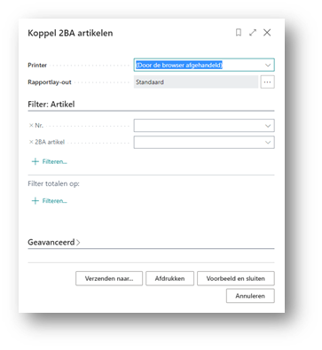
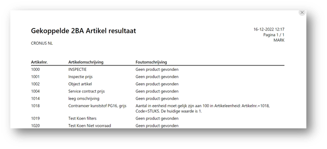

# Handleiding 2BA Integration
Deze handleiding beschrijft hoe je de 2BA Integration app kunt gebruiken om te zoeken in de 2BA database vanuit Business Central en een gevonden 2BA product/trade item kunt omzetten naar een artikel in Business Central.

## Koppel 2BA artikel
Deze kan men gebruiken om te proberen bestaande artikelen te koppelen aan een 2BA product. Je kunt deze opstarten vanuit het menu of via een taakwachtrijpost:

Geef eventueel filters op als je maar een deel van de artikelen langs wilt lopen (onder andere op artikelnr. en op de vlag "2BA artikel", om bijvoorbeeld alleen nog niet gekoppelde artikelen mee te nemen). Als het rapport klaar is krijg je een lijst met artikelen die niet gekoppeld konden worden met de reden waarom:

De betekenis van de melding is als volgt:
* **Geen product gevonden:** Het artikel heeft geen GTIN en er is op basis van de kruisverwijzingen (artikelreferenties) geen enkel product gevonden in 2BA. 
* **Product met product-id … is niet gevonden:** Het artikel heeft bestaan, maar is nu geen product meer in 2BA. Je moet opnieuw koppelen met een ander product.
* **Geen passende handelsartikelen gevonden:** Er is wel een product gevonden, maar geen van de bijbehorende handelsartikelen kwam overeen met een of meerdere artikelreferenties (leverancier + leveranciersartikelnr.).
* **Geen handelsartikel gevonden met product-id …:** Er is een product gevonden in 2BA, maar er bestaat geen handelsartikel (eventueel bij de op het artikel ingevulde leverancier) voor dit product. probeer opnieuw te koppelen.
* **Aantal in eenheid moet gelijk zijn aan…:** Er is een koppeling gevonden maar deze kan niet gemaakt worden omdat het aantal in de Inkoopeenheid afwijkt van het aantal in de gebruikseenheden van het gevonden handelsartikel.

*Heeft het artikel al een GTIN ingevuld, dan zoekt de koppelactie eerst rechtstreeks op die GTIN in plaats van op de kruisverwijzingen (artikelreferenties).*

De uitgevoerde zoekacties zijn eventueel terug te vinden in de 2BA aanvragen lijst.
Voor artikelen waar wel een match is gevonden is een nieuw 2BA artikel record aangemaakt. Deze kan men terugzien in de 2BA artikellijst.

Bij het koppelen worden op het artikel zelf direct al de GTIN, het fabrikant-artikelnummer, de vlag "2BA artikel" en, indien via het handelsartikel een bekende leverancier gevonden wordt, ook de leverancier en het leveranciersartikelnummer bijgewerkt. De overige artikelgegevens (omschrijving, eenheden, inkoop- en verkoopprijzen) worden pas bijgewerkt door de automatische update.

[:arrow_left:](../README.md) [Back](../README.md)
