# Handleiding 2BA Integration
Deze handleiding beschrijft hoe je de 2BA Integration app kunt gebruiken om te zoeken in de 2BA database vanuit Business Central en een gevonden 2BA product/trade item kunt omzetten naar een artikel in Business Central.

## Zoekaanvragen
Hiervoor ga je naar 2BA aanvragen:

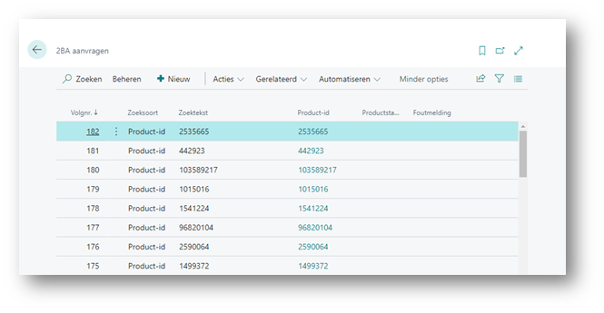

Klik op **[Nieuw]** (Het maken van een zoekaanvraag kan ook vanuit de artikellijst of de artikelkaart):

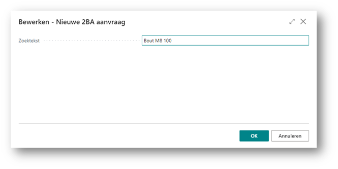

Geef een zoektekst op en klik op **[OK]**:

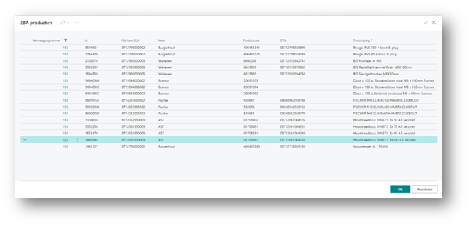

Kies een van de gevonden producten en klik op **[OK]**:

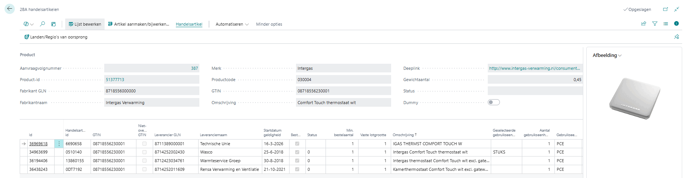

Nu krijg je een scherm met het gekozen product en zie je alle handelsartikelen van je eigen leveranciers waarbij je het GLN veld hebt gevuld en die zijn opgenomen in de lijst **2BA leveranciers** (zie [Leveranciers](installation-registration.md#leveranciers)). Andere leveranciers worden niet getoond.
Kies de leverancier die je als voorkeursleverancier wilt hebben en klik op **[Artikel aanmaken/bijwerken]**:

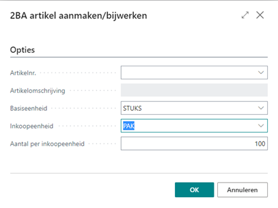

Vanuit dit scherm kun je via de actie **Landen/Regio's van oorsprong** ook de landen/regio's van oorsprong van het gekozen handelsartikel bekijken.

Geef je geen artikelnummer op dan wordt de nummerreeks gebruikt. Je kunt ook een bestaand artikelnummer opgeven. Dan krijg je de volgende vraag:

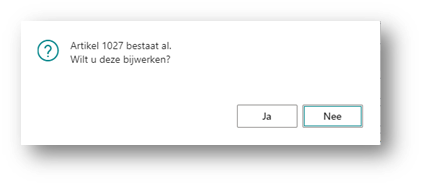

Kies je voor **[Ja]** dan zal het opgegeven artikel worden bijgewerkt met de gegevens van het gekozen product.
Heb je het gekozen product al eens omgezet in een artikel in Business Central, dan wordt dit artikel direct in het nummerveld getoond samen met zijn omschrijving. Als je dan doorgaat, wordt het artikel bijgewerkt.
De basiseenheid wordt voorgesteld op basis van de eenheid die in 2BA is gebruikt. Deze kan naar believen gewijzigd worden.
De inkoopeenheid wordt ook voorgesteld op basis van de eenheid in 2BA. Hier kan men een eigen eenheid kiezen. Als het aantal per inkoopeenheid groter is dan 1, dan mogen de basiseenheid en de inkoopeenheid niet hetzelfde zijn. De verhouding tussen deze eenheden wordt bij de aanmaak ingesteld op het aantal per inkoopeenheid.

**Let op bij verschillende aantallen gebruikseenheden per verpakking:** biedt je voorkeursleverancier hetzelfde product aan via meerdere handelsartikelen (verpakkingen) met een verschillend aantal gebruikseenheden (bijvoorbeeld een doos van 6 én een doos van 12), dan maakt de app naast de door jou gekozen inkoopeenheid automatisch ook voor elke andere verpakking van diezelfde leverancier een extra artikeleenheid en bijbehorende inkoopprijs aan. Hiervoor geef je zelf verschillende eenheden op uit de Eenheden tabel (zie [Eenheden vertaling](installation-registration.md#eenheden-vertaling)) en deze zet je in het veld **Geselecteerde gebruikseenheidcode** op het handelsartikel. Het veld hoef je niet te vullen als het aantal gebruikseenheden gelijk is aan 1.

Blijft **Geselecteerde gebruikseenheidcode** leeg als het aantal gebruikseenheden ongelijk aan 1 is, dan breekt het aanmaken/bijwerken van het artikel af met een foutmelding dat de artikeleenheid niet aangemaakt kan worden met een lege code. Zorg er ook voor dat verschillende aantallen gebruikseenheden niet per ongeluk naar dezelfde Business Central eenheid wijzen: dat geeft de foutmelding dat het aantal per eenheid niet gelijk is, omdat één eenheidcode maar één vaste hoeveelheid per artikel kan hebben.

Als de gegevens compleet zijn druk je op **[OK]**:

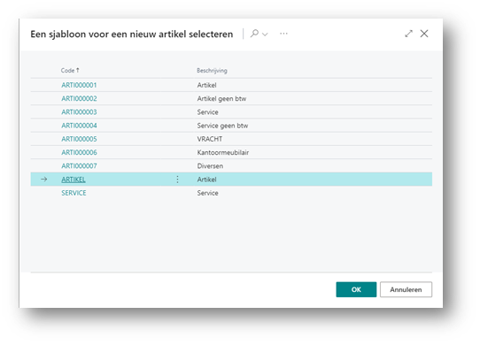

Nu krijg je een lijst met sjablonen om een artikel aan te maken. Kies het juiste slabloon en druk op **[OK]**:

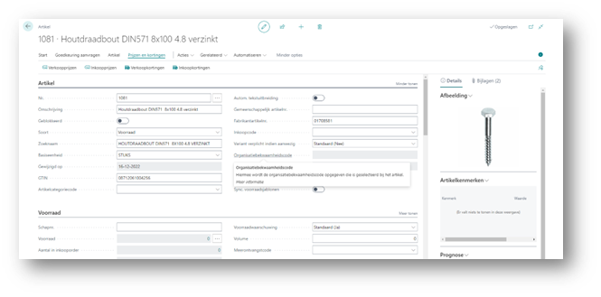

Het artikel is nu aangemaakt volgens het sjabloon. Naast het artikel zijn ook de volgende gerelateerde zaken aangemaakt:

Artikeleenheden:

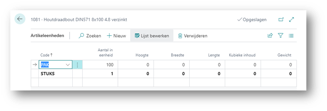

Artikelreferenties:

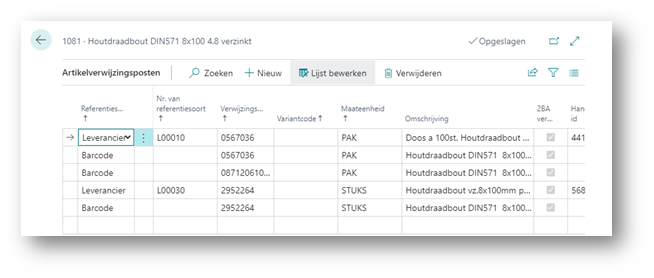

Inkoopprijzen:

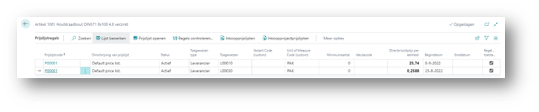

Verkoopprijzen (indien prijs/winst berekenen staat ingesteld op Prijs=kosten+winst):

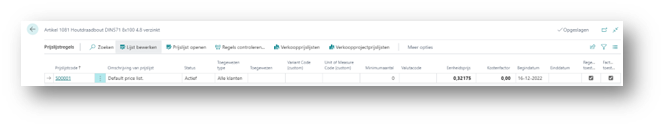

2BA artikel:

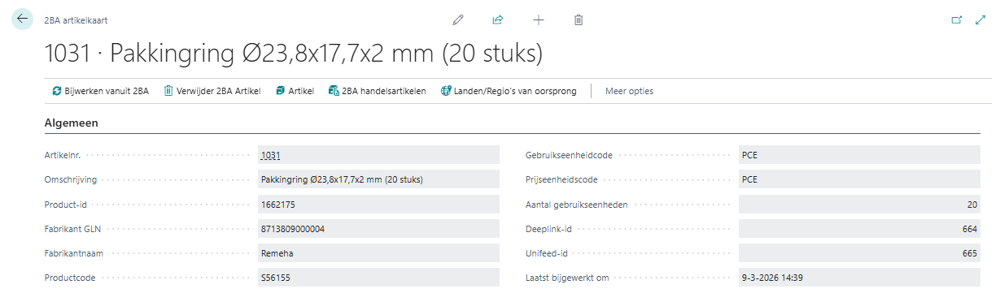

Met deze gegevens is een koppeling gelegd tussen het artikel in Business Central en het Product in 2BA. Dit wordt ook gebruikt bij de automatische update. 
Op deze pagina kun je de koppeling ook ongedaan maken door het 2BA artikel weg te gooien. Tevens worden dan de vanuit 2BA aangemaakte artikelreferenties en de vanuit 2BA aangemaakte leverancier-artikelnummers (artikelreferenties) naar de handelsartikelen weggegooid. Alle andere gegevens blijven bestaan.

Koppelingen:

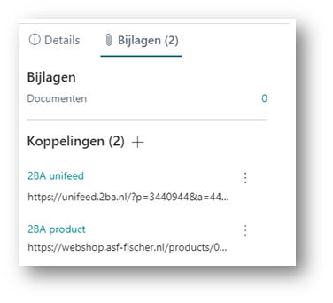

[:arrow_left:](../README.md) [Back](../README.md)